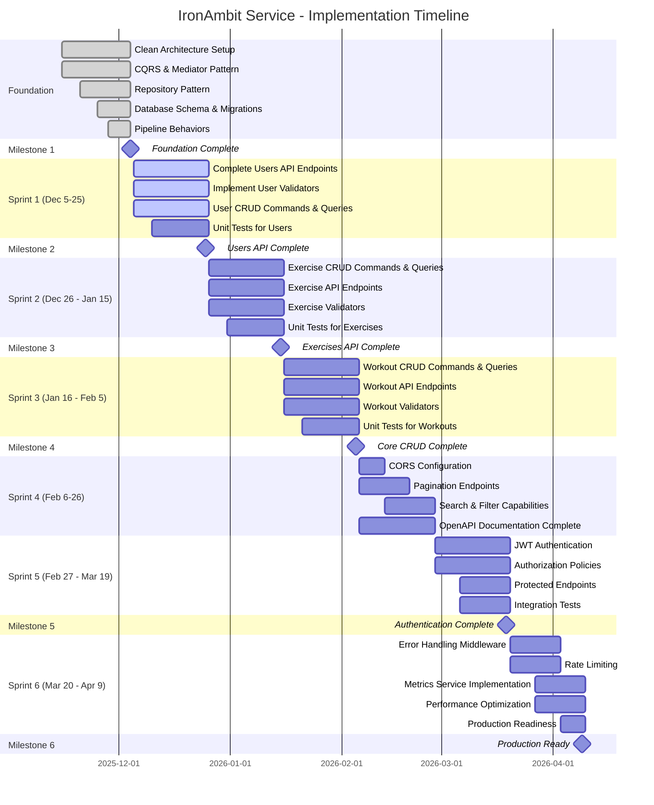

# IronAmbit Service - Features & Timeline

## Overview

This document outlines the high-level features of the IronAmbit Service application organized by Clean Architecture layers. The timeline shows planned implementation across 3-week sprints with key milestones.

---

## Features by Architecture Layer

### 1. API Endpoints (Presentation Layer)

**Description**: RESTful API endpoints using Minimal API style with proper error handling, validation, and OpenAPI documentation.

**Components**:
- User Management API
- Exercise Management API  
- Workout Management API

**Current Status**: 🔄 In Progress (10% - Only CreateUser endpoint exists)

**Key Capabilities**:
- Minimal API endpoint mapping with route builders
- Request/response handling with proper HTTP status codes
- Validation error responses with Problem Details
- OpenAPI/Swagger documentation with tags and summaries
- Health check endpoints for monitoring

---

### 2. CQRS Commands & Queries (Application Layer)

**Description**: Command Query Responsibility Segregation pattern implementation using custom mediator with separate command and query dispatchers.

**Components**:
- User Commands (Create, Update, Delete)
- User Queries (GetById, GetAll, GetPaged)
- Exercise Commands (Create, Update, Delete)
- Exercise Queries (GetById, GetAll, GetPaged, GetByCategory, GetByMuscleGroup)
- Workout Commands (Create, Update, Delete)
- Workout Queries (GetById, GetAll, GetPaged, GetByUser, GetByDateRange)

**Current Status**: 🔄 In Progress (5% - Only CreateUserCommand and GetUserByIdQuery exist)

**Key Capabilities**:
- Command handlers for write operations
- Query handlers for read operations
- Separate command and query dispatchers
- Result pattern for error handling
- Auto-registration of handlers via reflection

---

### 3. Pipeline Behaviors (Application Layer)

**Description**: Cross-cutting concerns implemented as pipeline behaviors that wrap command and query execution.

**Components**:
- Validation Behaviors (FluentValidation integration)
- Performance Behaviors (execution timing and logging)
- Metrics Behaviors (business metrics tracking)

**Current Status**: ✅ Complete (100% - All behaviors implemented)

**Key Capabilities**:
- Automatic validation before command/query execution
- Performance monitoring with configurable thresholds
- Business metrics collection for analytics
- Separate pipelines for commands and queries

---

### 4. Repository Pattern (Infrastructure Layer)

**Description**: Data access abstraction using repository pattern with generic base repository and specialized repositories per entity.

**Components**:
- Generic Repository (IRepository<T>)
- User Repository with specialized queries
- Exercise Repository with category/muscle group queries
- Workout Repository with user/date range queries

**Current Status**: ✅ Complete (100% - All repositories implemented)

**Key Capabilities**:
- Full CRUD operations (Create, Read, Update, Delete)
- Pagination support with GetPagedAsync
- Custom queries per entity (GetByUsername, GetByCategory, GetByDateRange, etc.)
- Async operations throughout
- Count and Any operations for existence checks

---

### 5. Database & Migrations (Infrastructure Layer)

**Description**: Entity Framework Core implementation with SQLite (default) and SQL Server support, including database migrations and health checks.

**Components**:
- ApplicationDbContext with entity configurations
- Initial migration with all three entities
- Database health checks
- Automatic timestamp management (CreatedAt, UpdatedAt)

**Current Status**: ✅ Complete (100% - Database schema and migrations ready)

**Key Capabilities**:
- Entity Framework Core 10
- SQLite for development, SQL Server for production
- Automatic timestamp management in DbContext
- Database health checks for monitoring
- Index optimization for common queries

---

### 6. Domain Models & Business Logic (Domain Layer)

**Description**: Core business entities, enums, value objects, and domain errors following DDD principles.

**Components**:
- User Entity (authentication and profile)
- Exercise Entity (exercise library with categories)
- Workout Entity (workout logging with sets/reps/weight)
- DifficultyType Enum (Beginner, Intermediate, Advanced)
- Domain Errors (UserErrors, future: ExerciseErrors, WorkoutErrors)
- Result Pattern (Result<T> for operation outcomes)

**Current Status**: ✅ Complete (100% - All entities and patterns defined)

**Key Capabilities**:
- Rich domain entities with validation constraints
- Enumerations for type safety
- Domain-specific error definitions
- Result pattern for error handling
- Base entity with common properties

---

### 7. Validation (Application Layer)

**Description**: FluentValidation integration for command and query validation with automatic validation pipeline behavior.

**Components**:
- Command validators
- Query validators
- Validation behavior integration

**Current Status**: 🔄 In Progress (10% - Framework integrated, validators not implemented)

**Key Capabilities**:
- Declarative validation rules
- Automatic validation before handler execution
- Detailed validation error messages
- Integration with ASP.NET Core Problem Details

---

### 8. Logging & Observability (Cross-Cutting)

**Description**: Structured logging with Serilog, custom enrichers, and performance monitoring.

**Components**:
- Serilog configuration
- Custom enrichers (User, Correlation)
- Performance logging in behaviors
- Health check endpoints

**Current Status**: ✅ Complete (100% - Logging infrastructure ready)

**Key Capabilities**:
- Structured logging with Serilog
- Console and file sinks
- Custom enrichment for context
- Performance threshold warnings
- Health check monitoring

---

### 9. Authentication & Authorization (Cross-Cutting)

**Description**: User authentication using JWT tokens and role-based authorization for API endpoints.

**Components**:
- JWT token generation and validation
- Role-based authorization policies
- Authentication middleware

**Current Status**: 📝 Planned (0% - Not started)

**Key Capabilities**:
- JWT bearer token authentication
- Role-based access control (Admin, User)
- Protected endpoints
- Token refresh mechanism

---

### 10. CORS Configuration (Cross-Cutting)

**Description**: Cross-Origin Resource Sharing configuration to allow frontend client access.

**Components**:
- CORS policy configuration
- Allowed origins for Client app

**Current Status**: 📝 Planned (0% - Not started)

**Key Capabilities**:
- Allow http://localhost:4321 (Client dev)
- Configurable allowed origins
- Proper CORS headers

---

## Project Timeline

---

## Sprint Summary

### Sprint 1: Users Feature Complete (Dec 5-25, 2025)
**Goal**: Complete all Users CRUD operations with full API endpoint coverage  
**Deliverables**:
- All User endpoints (GET, POST, PUT, DELETE)
- Complete User commands and queries
- FluentValidation validators for User operations
- Unit tests for User handlers

### Sprint 2: Exercises Feature Complete (Dec 26, 2025 - Jan 15, 2026)
**Goal**: Complete all Exercises CRUD operations  
**Deliverables**:
- All Exercise endpoints with category/muscle group filtering
- Complete Exercise commands and queries
- FluentValidation validators for Exercise operations
- Unit tests for Exercise handlers

### Sprint 3: Workouts Feature Complete (Jan 16 - Feb 5, 2026)
**Goal**: Complete all Workouts CRUD operations  
**Deliverables**:
- All Workout endpoints with user/date filtering
- Complete Workout commands and queries
- FluentValidation validators for Workout operations
- Unit tests for Workout handlers

### Sprint 4: API Enhancement (Feb 6-26, 2026)
**Goal**: Add API enhancement features  
**Deliverables**:
- CORS configuration for Client app
- Pagination on all GET endpoints
- Search and filter capabilities
- Complete OpenAPI documentation

### Sprint 5: Security & Testing (Feb 27 - Mar 19, 2026)
**Goal**: Implement authentication and comprehensive testing  
**Deliverables**:
- JWT authentication implementation
- Role-based authorization
- Protected API endpoints
- Integration test suite

### Sprint 6: Production Readiness (Mar 20 - Apr 9, 2026)
**Goal**: Production-ready features and optimization  
**Deliverables**:
- Global error handling middleware
- Rate limiting
- Metrics service implementation
- Performance optimization
- Production deployment configuration

---

## Key Milestones

| Milestone | Date | Criteria |
|-----------|------|----------|
| 🎯 Foundation Complete | Dec 4, 2025 | Clean Architecture, CQRS, Repositories, Database ready |
| 🎯 Users API Complete | Dec 25, 2025 | Full CRUD for Users with tests |
| 🎯 Exercises API Complete | Jan 15, 2026 | Full CRUD for Exercises with tests |
| 🎯 Core CRUD Complete | Feb 5, 2026 | All three entities fully functional |
| 🎯 Authentication Complete | Mar 19, 2026 | JWT auth and authorization working |
| 🎯 Production Ready | Apr 9, 2026 | All features complete, tested, documented |

---

## Status Legend

- ✅ **Complete**: Feature fully implemented and tested
- 🔄 **In Progress**: Feature partially implemented
- 📝 **Planned**: Feature not started, planned for future sprint
- 🚫 **Blocked**: Feature blocked by dependencies

---

*Last Updated: December 5, 2025*
